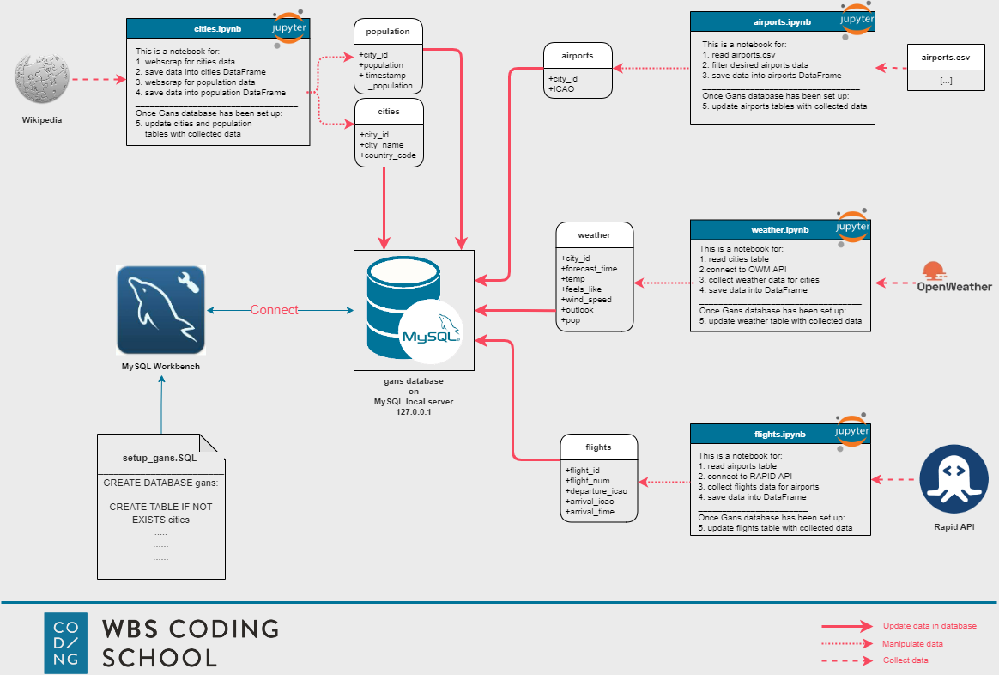
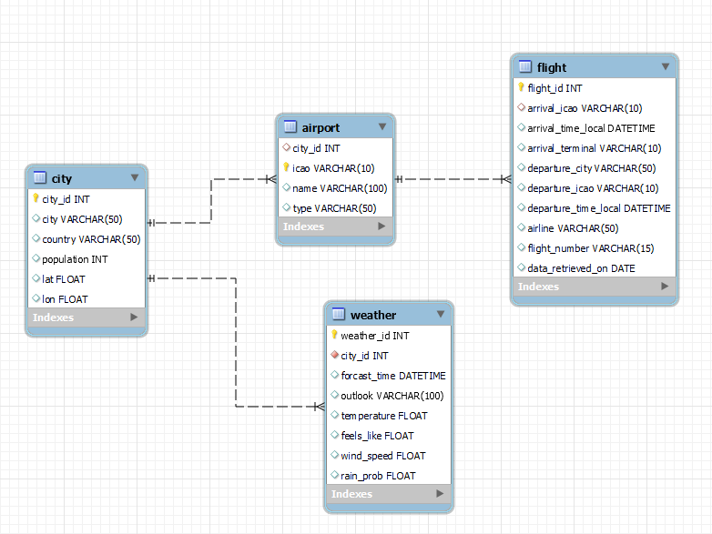
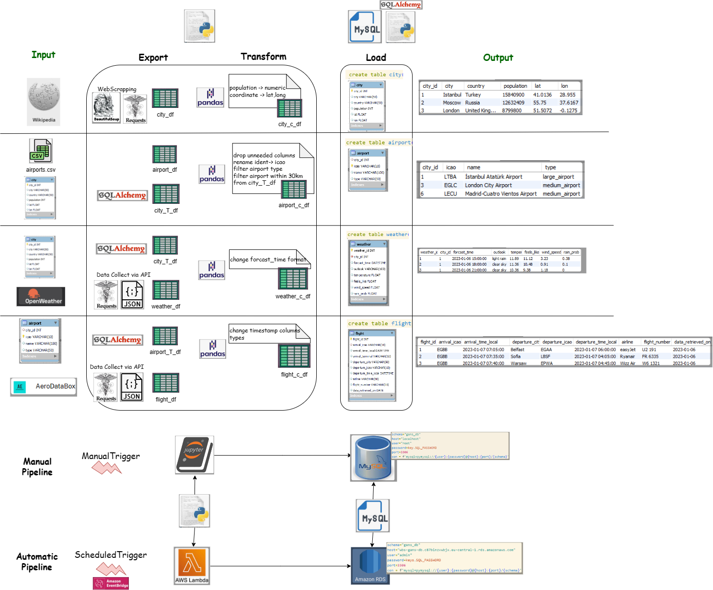

# WebScrap_GansEscooter
Using web scrapping and APIs to create a db, import it to MYSQL and analyze it

### StoryLine

As DataEngineer in Escooter sharing Company "Gans",
You are requesed to create AWS-based pipeline to help Data Analyst to figure out how the Escooters should be best located/ distributed

The pipeline should collect:
For each Biggest cities in Europe (based on population):
1. What is tomorrow weather predection
2. what is the status of arrival flights from the airports located around 30km away from the city center


### Expected final Architecture



## Implementation

### MySQL DB Diagram




### Pipeline Workflow


<a href="https://app.diagrams.net/#G14g7dpMOla3xDre3g0zHTYKjjAkUVELxz" target="_blank">Open in diagrams.net</a>


### Integration Hint
```
Please add your Key for the API Keys and passwords inside the file keys/key.py
```